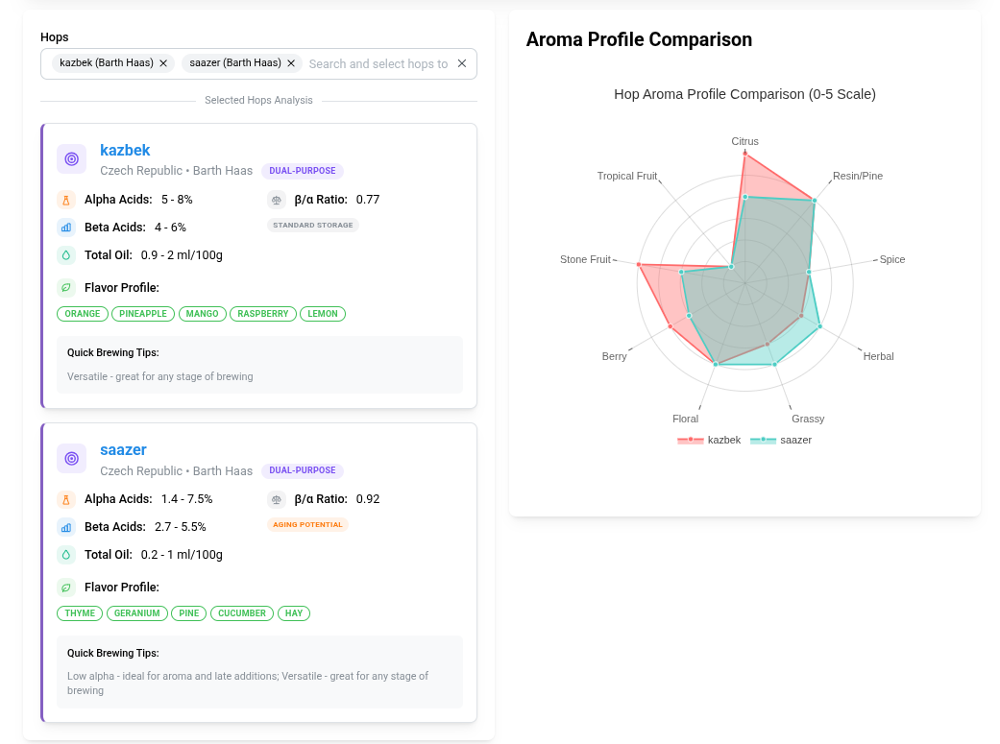
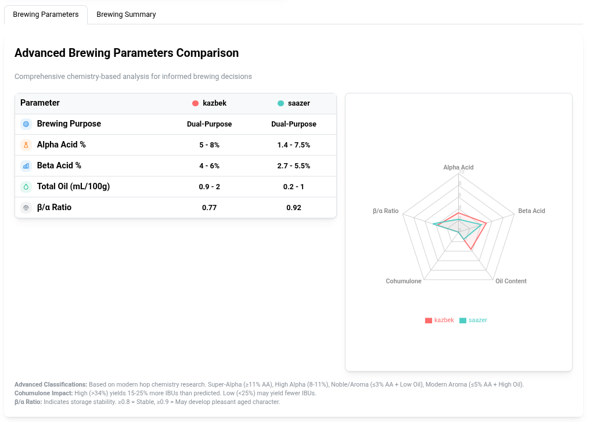

[](https://github.com/kasperg3/HopDatabase/actions/workflows/ci.yaml)

# 🍺 Hop Database & Interactive Comparison Tool

Welcome to the Hop Database project! This comprehensive database contains detailed information from various hop producers' websites, combined with an advanced interactive web application for brewing analysis and hop comparison.

## 🌐 Live Website

**[🔗 Try the Hop Comparison Tool](https://kasperg3.github.io/HopDatabase)** - Advanced brewing analysis and hop comparison tool



## ✨ Features

### 🔬 **Advanced Hop Analysis**
- **Interactive Radar Charts** - Visual comparison of hop aroma profiles
- **Chemistry-Based Classifications** - Modern hop science with Alpha/Beta acid analysis
- **Individual Hop Recommendations** - Personalized brewing guidance for each hop
- **Comprehensive Parameter Comparison** - Side-by-side numerical and visual data



### 📊 **Smart Brewing Insights**
- **Purpose-Based Classification** - Super-Alpha, Bittering, Aroma, Noble, Dual-Purpose
- **Cohumulone Impact Analysis** - IBU yield predictions based on modern research
- **Storage Stability Assessment** - Beta:Alpha ratio analysis for aging potential
- **Brewing Process Optimization** - Whirlpool, dry hop, and biotransformation guidance

### 🎯 **User-Friendly Interface**
- **Responsive Design** - Works seamlessly on desktop and mobile
- **Real-Time Analysis** - Instant calculations and recommendations
- **Clean Data Display** - Focus on essential brewing information
- **Professional Visualization** - Publication-quality charts and tables

## 📈 Data Sources

Our comprehensive database aggregates information from industry-leading hop producers:

* **🌾 Hopsteiner** - Premium hop varieties and detailed chemistry data
* **🏔️ Yakima Chief Hops** - Pacific Northwest hop expertise
* **🇩🇪 BarthHaas** - Traditional European varieties and innovation
* **🇺🇸 Crosby Hops** - American hop varieties with comprehensive aroma profiles

## 🚀 Getting Started

### For Brewers (Web Application)
1. Visit **[the live application](https://kasperg3.github.io/HopDatabase)**
2. Select up to 5 hops from our comprehensive database
3. Analyze aroma profiles using interactive radar charts
4. Review detailed brewing recommendations for each hop
5. Compare chemistry parameters side-by-side

### For Developers (Local Setup)
```bash
# Clone the repository
git clone https://github.com/kasperg3/HopDatabase.git
cd HopDatabase

# Install Python dependencies
pip install -r requirements.txt

# Install the hop_database package in development mode
pip install -e .

# Run the scraper to update data
python run_scrapers.py

# For website development
cd website
npm install
npm start
```

## 🔧 Technical Implementation

### Python Package Structure
```
hop_database/
├── __init__.py              # Main package interface
├── models/                  # Data models and validation
│   ├── __init__.py
│   └── hop_model.py        # HopEntry dataclass and utilities
├── scrapers/               # Data collection modules
│   ├── __init__.py
│   ├── yakima_chief.py     # Yakima Chief Hops scraper
│   ├── barth_haas.py       # BarthHaas scraper
│   ├── hopsteiner.py       # Hopsteiner scraper
│   └── crosby_hops.py      # Crosby Hops scraper
└── utils/                  # Utility functions
    └── __init__.py
```

### Usage as Python Package
```python
from hop_database import HopEntry, save_hop_entries
from hop_database.scrapers import yakima_chief, barth_haas, hopsteiner, crosby_hops

# Run individual scrapers
ych_hops = yakima_chief.scrape()
bh_hops = barth_haas.scrape()
hs_hops = hopsteiner.scrape()
ch_hops = crosby_hops.scrape()

# Combine and save data
all_hops = ych_hops + bh_hops + hs_hops + ch_hops
save_hop_entries(all_hops, 'data/hops.json')
```

### Data Processing
- **Web Scraping Pipeline** - Automated data extraction from producer websites
- **Data Normalization** - Consistent format across all sources
- **Quality Validation** - Ensures accuracy and completeness

### Frontend Technology
- **React + Mantine UI** - Modern, responsive user interface
- **Recharts** - Interactive data visualization
- **Advanced State Management** - Efficient data processing and filtering

### Brewing Science Integration
- **Research-Based Classifications** - Modern hop chemistry understanding
- **Advanced Analytics** - Beta:Alpha ratios, cohumulone impact, oil content analysis
- **Professional Recommendations** - Industry-standard brewing guidance

## 📋 Data Format

The Hop Database stores information in JSON format with standardized keys across all providers:

```json
{
  "name": "Hop Variety Name",
  "alpha_from": "10.0", 
  "alpha_to": "15.0",
  "beta_from": "3.0",
  "beta_to": "5.0",
  "oil_from": "1.5",
  "oil_to": "2.5",
  "co_h_from": "25",
  "co_h_to": "35",
  "country": "USA",
  "aroma": ["citrus", "tropical", "pine"],
  "source": "Hopsteiner"
}
```

## 🤝 Contributing

We welcome contributions from the brewing and development communities! Here's how you can help:

### 🔍 **Data Contributions**
- Report inaccurate hop information
- Suggest additional hop varieties
- Provide missing chemistry data

### 💻 **Code Contributions**
- Enhance the web application
- Improve scraping algorithms  
- Add new visualization features
- Optimize performance

### 📖 **Documentation**
- Improve brewing recommendations
- Add usage examples
- Translate content

Please read our [Contribution Guidelines](CONTRIBUTING.md) for detailed information.

## 📊 Project Stats

- **500+ Hop Varieties** across multiple producers
- **Real-time Data Updates** via automated scraping
- **Mobile-Responsive Design** for on-the-go brewing
- **Science-Based Analysis** using modern hop research

## 📄 License

This project is licensed under the [MIT License](LICENSE).

## 📬 Contact & Support

- **Email**: [kaspergrontved@gmail.com](mailto:kaspergrontved@gmail.com)
- **Issues**: [GitHub Issues](https://github.com/kasperg3/HopDatabase/issues)
- **Discussions**: [GitHub Discussions](https://github.com/kasperg3/HopDatabase/discussions)

---

**🍻 Happy Brewing!** 

*Made with ❤️ for the homebrewing and craft beer community*
